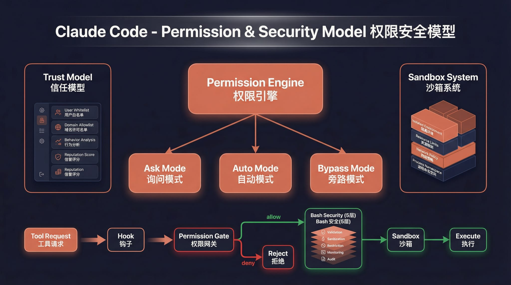

# Claude Code Haha

<p align="right"><a href="./README.md">中文</a> | <strong>English</strong></p>

A **locally runnable version** repaired from the leaked Claude Code source, with support for any Anthropic-compatible API endpoint such as MiniMax and OpenRouter.

> The original leaked source does not run as-is. This repository fixes multiple blocking issues in the startup path so the full Ink TUI can work locally.

<p align="center">
  
</p>

## Table of Contents

- [Features](#features)
- [Architecture Overview](#architecture-overview)
- [Quick Start](#quick-start)
- [Environment Variables](#environment-variables)
- [Fallback Mode](#fallback-mode)
- [FAQ](#faq)
- [Fixes Compared with the Original Leaked Source](#fixes-compared-with-the-original-leaked-source)
- [Project Structure](#project-structure)
- [Tech Stack](#tech-stack)

---

## Features

- Full Ink TUI experience (matching the official Claude Code interface)
- `--print` headless mode for scripts and CI
- MCP server, plugin, and Skills support
- Custom API endpoint and model support ([Third-Party Models Guide](docs/third-party-models.en.md))
- Fallback Recovery CLI mode

---

## Architecture Overview

<table>
  <tr>
    <td align="center" width="25%"><br><b>Overall architecture</b></td>
    <td align="center" width="25%"><br><b>Request lifecycle</b></td>
    <td align="center" width="25%"><br><b>Tool system</b></td>
    <td align="center" width="25%"><br><b>Multi-agent architecture</b></td>
  </tr>
  <tr>
    <td align="center" width="25%"><br><b>Terminal UI</b></td>
    <td align="center" width="25%"><br><b>Permissions and security</b></td>
    <td align="center" width="25%"><br><b>Services layer</b></td>
    <td align="center" width="25%"><br><b>State and data flow</b></td>
  </tr>
</table>

---

## Quick Start

### 1. Install Bun

This project requires [Bun](https://bun.sh). If Bun is not installed on the target machine yet, use one of the following methods first:

```bash
# macOS / Linux (official install script)
curl -fsSL https://bun.sh/install | bash
```

If a minimal Linux image reports `unzip is required to install bun`, install `unzip` first:

```bash
# Ubuntu / Debian
apt update && apt install -y unzip
```

```bash
# macOS (Homebrew)
brew install bun
```

```powershell
# Windows (PowerShell)
powershell -c "irm bun.sh/install.ps1 | iex"
```

After installation, reopen the terminal and verify:

```bash
bun --version
```

### 2. Install project dependencies

```bash
bun install
```

### 3. Configure environment variables

Copy the example file and fill in your API key:

```bash
cp .env.example .env
```

Edit `.env` (the example below uses [MiniMax](https://platform.minimaxi.com/subscribe/token-plan?code=1TG2Cseab2&source=link) as the API provider — you can replace it with any compatible service):

```env
# API authentication (choose one)
ANTHROPIC_API_KEY=sk-xxx          # Standard API key via x-api-key header
ANTHROPIC_AUTH_TOKEN=sk-xxx       # Bearer token via Authorization header

# API endpoint (optional, defaults to Anthropic)
ANTHROPIC_BASE_URL=https://api.minimaxi.com/anthropic

# Model configuration
ANTHROPIC_MODEL=MiniMax-M2.7-highspeed
ANTHROPIC_DEFAULT_SONNET_MODEL=MiniMax-M2.7-highspeed
ANTHROPIC_DEFAULT_HAIKU_MODEL=MiniMax-M2.7-highspeed
ANTHROPIC_DEFAULT_OPUS_MODEL=MiniMax-M2.7-highspeed

# Timeout in milliseconds
API_TIMEOUT_MS=3000000

# Disable telemetry and non-essential network traffic
DISABLE_TELEMETRY=1
CLAUDE_CODE_DISABLE_NONESSENTIAL_TRAFFIC=1
```

> **Tip**: You can also configure environment variables via the `env` field in `~/.claude/settings.json`. This is consistent with the official Claude Code configuration:
>
> ```json
> {
>   "env": {
>     "ANTHROPIC_AUTH_TOKEN": "sk-xxx",
>     "ANTHROPIC_BASE_URL": "https://api.minimaxi.com/anthropic",
>     "ANTHROPIC_MODEL": "MiniMax-M2.7-highspeed"
>   }
> }
> ```
>
> Priority: Environment variables > `.env` file > `~/.claude/settings.json`

### 4. Start

#### macOS / Linux

```bash
# Interactive TUI mode (full interface)
./bin/claude-haha

# Headless mode (single prompt)
./bin/claude-haha -p "your prompt here"

# Pipe input
echo "explain this code" | ./bin/claude-haha -p

# Show all options
./bin/claude-haha --help
```

#### Windows

> **Prerequisite**: [Git for Windows](https://git-scm.com/download/win) must be installed (provides Git Bash, which the project's internal shell execution depends on).

The startup script `bin/claude-haha` is a bash script and cannot run directly in cmd or PowerShell. Use one of the following methods:

**Option 1: PowerShell / cmd — call Bun directly (recommended)**

```powershell
# Interactive TUI mode
bun --env-file=.env ./src/entrypoints/cli.tsx

# Headless mode
bun --env-file=.env ./src/entrypoints/cli.tsx -p "your prompt here"

# Fallback Recovery CLI
bun --env-file=.env ./src/localRecoveryCli.ts
```

**Option 2: Run inside Git Bash**

```bash
# Same usage as macOS / Linux
./bin/claude-haha
```

> **Note**: Some features (voice input, Computer Use, sandbox isolation, etc.) are not available on Windows. This does not affect the core TUI interaction.

---

## Environment Variables

| Variable | Required | Description |
|------|------|------|
| `ANTHROPIC_API_KEY` | One of two | API key sent via the `x-api-key` header |
| `ANTHROPIC_AUTH_TOKEN` | One of two | Auth token sent via the `Authorization: Bearer` header |
| `ANTHROPIC_BASE_URL` | No | Custom API endpoint, defaults to Anthropic |
| `ANTHROPIC_MODEL` | No | Default model |
| `ANTHROPIC_DEFAULT_SONNET_MODEL` | No | Sonnet-tier model mapping |
| `ANTHROPIC_DEFAULT_HAIKU_MODEL` | No | Haiku-tier model mapping |
| `ANTHROPIC_DEFAULT_OPUS_MODEL` | No | Opus-tier model mapping |
| `API_TIMEOUT_MS` | No | API request timeout, default `600000` (10min) |
| `DISABLE_TELEMETRY` | No | Set to `1` to disable telemetry |
| `CLAUDE_CODE_DISABLE_NONESSENTIAL_TRAFFIC` | No | Set to `1` to disable non-essential network traffic |

---

## Fallback Mode

If the full TUI has issues, use the simplified readline-based interaction mode:

```bash
CLAUDE_CODE_FORCE_RECOVERY_CLI=1 ./bin/claude-haha
```

---

## Fixes Compared with the Original Leaked Source

The leaked source could not run directly. This repository mainly fixes the following issues:

| Issue | Root cause | Fix |
|------|------|------|
| TUI does not start | The entry script routed no-argument startup to the recovery CLI | Restored the full `cli.tsx` entry |
| Startup hangs | The `verify` skill imports a missing `.md` file, causing Bun's text loader to hang indefinitely | Added stub `.md` files |
| `--print` hangs | `filePersistence/types.ts` was missing | Added type stub files |
| `--print` hangs | `ultraplan/prompt.txt` was missing | Added resource stub files |
| **Enter key does nothing** | The `modifiers-napi` native package was missing, `isModifierPressed()` threw, `handleEnter` was interrupted, and `onSubmit` never ran | Added try/catch fault tolerance |
| Setup was skipped | `preload.ts` automatically set `LOCAL_RECOVERY=1`, skipping all initialization | Removed the default setting |

---

## Project Structure

```text
bin/claude-haha          # Entry script
preload.ts               # Bun preload (sets MACRO globals)
.env.example             # Environment variable template
src/
├── entrypoints/cli.tsx  # Main CLI entry
├── main.tsx             # Main TUI logic (Commander.js + React/Ink)
├── localRecoveryCli.ts  # Fallback Recovery CLI
├── setup.ts             # Startup initialization
├── screens/REPL.tsx     # Interactive REPL screen
├── ink/                 # Ink terminal rendering engine
├── components/          # UI components
├── tools/               # Agent tools (Bash, Edit, Grep, etc.)
├── commands/            # Slash commands (/commit, /review, etc.)
├── skills/              # Skill system
├── services/            # Service layer (API, MCP, OAuth, etc.)
├── hooks/               # React hooks
└── utils/               # Utility functions
```

---

## Tech Stack

| Category | Technology |
|------|------|
| Runtime | [Bun](https://bun.sh) |
| Language | TypeScript |
| Terminal UI | React + [Ink](https://github.com/vadimdemedes/ink) |
| CLI parsing | Commander.js |
| API | Anthropic SDK |
| Protocols | MCP, LSP |

---

## FAQ

### Q: `undefined is not an object (evaluating 'usage.input_tokens')`

**Cause**: `ANTHROPIC_BASE_URL` is misconfigured. The API endpoint is returning HTML or another non-JSON format instead of a valid Anthropic protocol response.

This project uses the **Anthropic Messages API protocol**. `ANTHROPIC_BASE_URL` must point to an endpoint compatible with Anthropic's `/v1/messages` interface. The Anthropic SDK automatically appends `/v1/messages` to the base URL, so:

- MiniMax: `ANTHROPIC_BASE_URL=https://api.minimaxi.com/anthropic` ✅
- OpenRouter: `ANTHROPIC_BASE_URL=https://openrouter.ai/api` ✅
- OpenRouter (wrong): `ANTHROPIC_BASE_URL=https://openrouter.ai/anthropic` ❌ (returns HTML)

If your model provider only supports the OpenAI protocol, you need a proxy like LiteLLM for protocol translation. See the [Third-Party Models Guide](docs/third-party-models.en.md).

### Q: `Cannot find package 'bundle'`

```
error: Cannot find package 'bundle' from '.../claude-code-haha/src/entrypoints/cli.tsx'
```

**Cause**: Your Bun version is too old and doesn't support the required `bun:bundle` built-in module.

**Fix**: Upgrade Bun to the latest version:

```bash
bun upgrade
```

### Q: How to use OpenAI / DeepSeek / Ollama or other non-Anthropic models?

This project only supports the Anthropic protocol. If your model provider doesn't natively support the Anthropic protocol, you need a proxy like [LiteLLM](https://github.com/BerriAI/litellm) for protocol translation (OpenAI → Anthropic).

See the [Third-Party Models Guide](docs/third-party-models.en.md) for detailed setup instructions.

---

## Disclaimer

This repository is based on the Claude Code source leaked from the Anthropic npm registry on 2026-03-31. All original source code copyrights belong to [Anthropic](https://www.anthropic.com). It is provided for learning and research purposes only.
