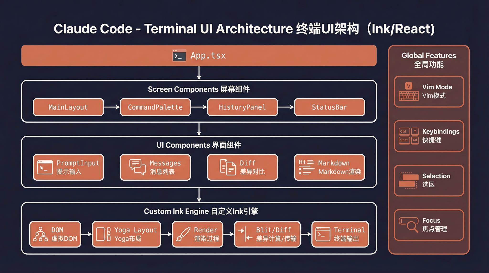

# Claude Code Haha

<div align="center">

[](https://github.com/NanmiCoder/cc-haha/stargazers)
[](https://github.com/NanmiCoder/cc-haha/network/members)
[](https://github.com/NanmiCoder/cc-haha/issues)
[](https://github.com/NanmiCoder/cc-haha/pulls)
[](https://github.com/NanmiCoder/cc-haha/blob/main/LICENSE)
[](README.md)
[](README.en.md)

</div>

A **locally runnable version** repaired from the leaked Claude Code source, with support for any Anthropic-compatible API endpoint such as MiniMax and OpenRouter.

> The original leaked source does not run as-is. This repository fixes multiple blocking issues in the startup path so the full Ink TUI can work locally.

<p align="center">
  
</p>

<p align="center">
  <a href="#features">Features</a> · <a href="#architecture-overview">Architecture</a> · <a href="#quick-start">Quick Start</a> · <a href="docs/guide/env-vars.en.md">Env Vars</a> · <a href="docs/guide/faq.en.md">FAQ</a> · <a href="docs/guide/global-usage.en.md">Global Usage</a> · <a href="#more-documentation">More Docs</a>
</p>

---

## Features

- Full Ink TUI experience (matching the official Claude Code interface)
- `--print` headless mode for scripts and CI
- MCP server, plugin, and Skills support
- Custom API endpoint and model support ([Third-Party Models Guide](docs/guide/third-party-models.en.md))
- **Computer Use desktop control** — [Guide](docs/features/computer-use.en.md)
- **Memory System** (cross-session persistent memory) — [Usage Guide](docs/memory/01-usage-guide.md)
- **Multi-Agent System** (agent orchestration, parallel tasks, Teams collaboration) — [Usage Guide](docs/agent/01-usage-guide.md) | [Implementation](docs/agent/02-implementation.md)
- **Skills System** (extensible capability plugins, custom workflows) — [Usage Guide](docs/skills/01-usage-guide.md) | [Implementation](docs/skills/02-implementation.md)
- Fallback Recovery CLI mode (`CLAUDE_CODE_FORCE_RECOVERY_CLI=1 ./bin/claude-haha`)

---

## Architecture Overview

<table>
  <tr>
    <td align="center" width="25%"><br><b>Overall architecture</b></td>
    <td align="center" width="25%"><br><b>Request lifecycle</b></td>
    <td align="center" width="25%"><br><b>Tool system</b></td>
    <td align="center" width="25%"><br><b>Multi-agent architecture</b></td>
  </tr>
  <tr>
    <td align="center" width="25%"><br><b>Terminal UI</b></td>
    <td align="center" width="25%"><br><b>Permissions and security</b></td>
    <td align="center" width="25%"><br><b>Services layer</b></td>
    <td align="center" width="25%"><br><b>State and data flow</b></td>
  </tr>
</table>

---

## Quick Start

### 1. Install Bun

```bash
# macOS / Linux
curl -fsSL https://bun.sh/install | bash

# macOS (Homebrew)
brew install bun

# Windows (PowerShell)
powershell -c "irm bun.sh/install.ps1 | iex"
```

> On minimal Linux images, if you see `unzip is required`, run `apt update && apt install -y unzip` first.

### 2. Install Dependencies and Configure

```bash
bun install
cp .env.example .env
# Edit .env with your API key — see docs/guide/env-vars.en.md for details
```

### 3. Start

#### macOS / Linux

```bash
./bin/claude-haha                          # Interactive TUI mode
./bin/claude-haha -p "your prompt here"    # Headless mode
./bin/claude-haha --help                   # Show all options
```

#### Windows

> **Prerequisite**: [Git for Windows](https://git-scm.com/download/win) must be installed.

```powershell
# PowerShell / cmd — call Bun directly
bun --env-file=.env ./src/entrypoints/cli.tsx

# Or run inside Git Bash
./bin/claude-haha
```

### 4. Global Usage (Optional)

Add `bin/` to your PATH to run from any directory. See [Global Usage Guide](docs/guide/global-usage.en.md):

```bash
export PATH="$HOME/path/to/claude-code-haha/bin:$PATH"
```

---

## Tech Stack

| Category | Technology |
|------|------|
| Runtime | [Bun](https://bun.sh) |
| Language | TypeScript |
| Terminal UI | React + [Ink](https://github.com/vadimdemedes/ink) |
| CLI parsing | Commander.js |
| API | Anthropic SDK |
| Protocols | MCP, LSP |

---

## More Documentation

| Document | Description |
|------|------|
| [Environment Variables](docs/guide/env-vars.en.md) | Full env var reference and configuration methods |
| [Third-Party Models](docs/guide/third-party-models.en.md) | Using OpenAI / DeepSeek / Ollama and other non-Anthropic models |
| [Computer Use](docs/features/computer-use.en.md) | Desktop control (screenshots, mouse, keyboard) |
| [Memory System](docs/memory/01-usage-guide.md) | Cross-session persistent memory usage and implementation |
| [Multi-Agent System](docs/agent/01-usage-guide.md) | Agent orchestration, parallel tasks and Teams collaboration |
| [Skills System](docs/skills/01-usage-guide.md) | Extensible capability plugins, custom workflows and conditional activation |
| [Global Usage](docs/guide/global-usage.en.md) | Run claude-haha from any directory |
| [FAQ](docs/guide/faq.en.md) | Common error troubleshooting |
| [Source Fixes](docs/reference/fixes.en.md) | Fixes compared with the original leaked source |
| [Project Structure](docs/reference/project-structure.en.md) | Code directory structure |

---

## Disclaimer

This repository is based on the Claude Code source leaked from the Anthropic npm registry on 2026-03-31. All original source code copyrights belong to [Anthropic](https://www.anthropic.com). It is provided for learning and research purposes only.
